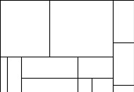

# An Approximate Solution to the Packing Problem

## Summary

This project attempts to use an approximate solution to the Bin-Packing Problem for Knolling, a popular photography style. The first-fit algorithm is used.

For more information, please read the paper located in the ```paper/paper.pdf```.

## Dependencies
* ImageMagick
* feh
* pwgen (optional for random name generation)


## How to use
The program is located in the ```program``` directory. The rest of the instructions assume you are acting from within this directory.

There is already a pre-compiled binary of the main program in the repo. To recompile, run ```make```.

To run the program, run ```./run.sh```. It will prompt you for the number of boxes to randomly generate. Type a number for a "demo" of the program. If you wish to use pre-defined box sizes in the ```config``` file, type ```0```.

## Languages
Main language: C++

Helper language: Shell scripting

## Example Result


The result of running the program on a set of 12 randomly generated rectangles. The rectangles represent real-life objects that may be used for knolling.
